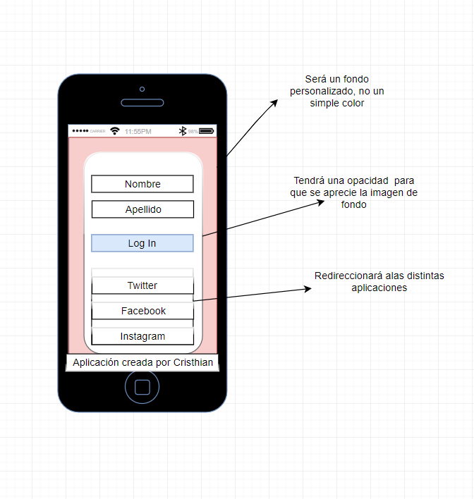
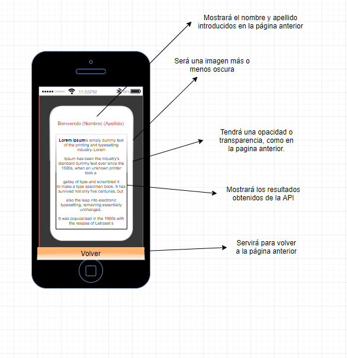

# Jokes Application

The * first page * will ask for the user name first and last name.
- Background image
- Text boxes for first and last name.
- Button that will take us to page 2.
- Use of flex, can be viewed horizontally / vertically.

The * second page * shows the username and last name of the previous page.
- List of data collected through an API. ( https://official-joke-api.appspot.com/jokes/programming/ten )
- Button to return to the home page.

Here is a small sample of what the application does:

